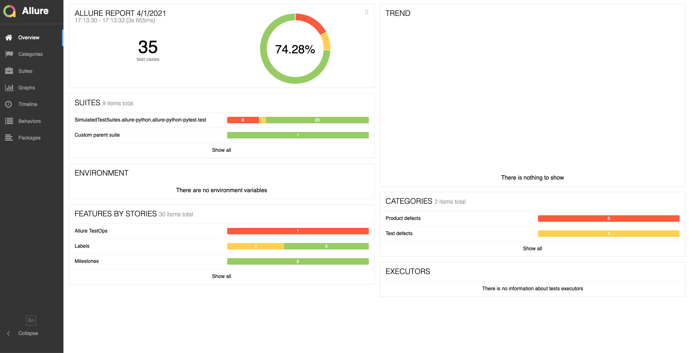

# Simplified, Local, Report Testing Backup System

## Getting Started
This was tested on Mac OS, and should work similarly on other Unix/Linux environments.

### Prerequisites

1. Python 3.8
2. [Allure Framework](https://docs.qameta.io/allure/#_installing_a_commandline)
3. Python virtual environment (strongly recommended)

### Installing

1. Install virtual environment (if not already) `python3 -m venv {virtual env name}`
2. Activate virtual environment (if not already) `source ../{virtual env name}/bin/activate`
3. Install necessary python packages `pip install -r ../requirements.txt`

## Running the tests 
If you just want to run the tests, execute the TestRunner.py file from the command line
`python3 TestRunner.py`

The test cases have been modified so that they randomly fail, so that there is some variety.
## High Level Overview
TestRunner.py is the main entry point and is the only script you need to execute. It does the following:

1. Create or ensure necessary output folders in this format:
```
SimplifiedLocalVersion
└── all-reports
    ├── last-run
    └── past-runs
```

2. If a test is in "last-run", move to "past-runs"
3. Run Pytest specific tests,
4. Output results to last-run with unique name `pytest_{current_timestamp}`
5. Create a Summary File of the test run, with the last Git Commit, tally of passed/failed tests and list of testcases with their pass status. Output to JSON. 
5. Repeat 3-5 for Behave
6. Gather the unproccessed results from all ran tests
7. Generate and serve an allure report of all tests that were just ran. Will automatically open up in browser. 

Here is what the folder should look like after a test run 
```
./all-reports
├── last-run
│   ├── behave_1617311613
│   │   ├── allure-report
│   │   ├── summary.json
│   │   └── unprocessed-results
│   └── pytest_1617311609
│       ├── allure-report
│       ├── summary.json
│       └── unprocessed-results
└── past-runs
    ├── behave_1617307982
    │   ├── allure-report
    │   ├── summary.json
    │   └── unprocessed-results
    └── pytest_1617307978
        ├── allure-report
        ├── summary.json
        └── unprocessed-results
```


And here is what you could expect from the Allure Report



